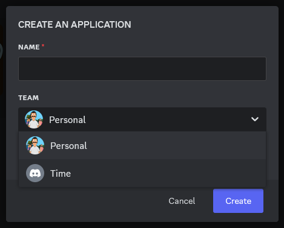
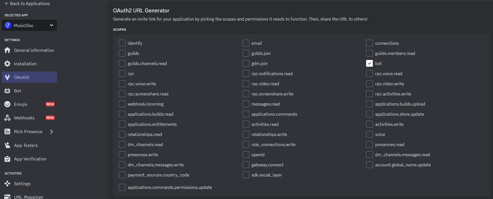
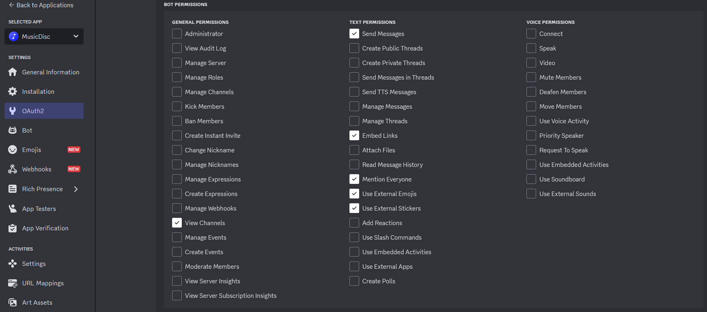

# Bot para Notificação de Lives no Discord

## Descrição

Este bot envia mensagens em um canal específico do Discord sempre que um streamer determinado iniciar uma live.

## Como funciona?

- O bot verifica se o streamer está ao vivo.
  - Se estiver, verifica se já foi enviada uma notificação
    - Se não for o caso, sorteia uma mensagem, faz as alterações necessárias e envia uma notificação para um canal de um servidor do Discord.
  - Se o streamer não estiver ao vivo, é exibida uma mensagem no terminal e o bot continua a verificação.

## Requisitos

- Python 3.12 ou superior, com `pip` configurado.
- Bibliotecas: `discord.py`, `requests` e `datetime`.
- Conta no Discord e Twitch, acesso ao Discord Developer Portal e ao Console da Twitch.
- Servidor no Discord com um canal de texto configurado.
- Editor de texto ou IDE (recomendado).

## Passo a Passo para Configuração

1. **Configuração Inicial:**
   - Crie uma pasta e adicione os seguintes arquivos:
     - `Main.py` (código principal do bot).
     - `logs.txt` (para registro de logs).
     - `credentials.py` (credenciais do bot).
     - `history_ids.json` (histórico de IDs das lives notificadas).

2. **Crie um App no Discord:**
   - Acesse o [Discord Developer Portal](https://discord.com/developers/applications). 
   - Crie um app
      
   - Depois vá até a sessão "OAuth2", selecione o scope como "bot"
     
   - Selecione permissões necessárias (conforme os intents especificados no código):
      
     - View channels
     - Send messages
     - Embed links
     - Mention everyone
     - Use external emojis
     - Use external stickers
   - Adicione o bot ao servidor desejado através da URL que é gerada. 
   > [!IMPORTANT]
   > É importante que tanto o servidor, quanto o canal em que as notificação serão enviadas permita que o bot tenha as mesmas permissões definidas para que as mensagens sejam enviadas.  

3. **Crie um App no Console da Twitch:**
   - Acesse o [Console da Twitch](https://dev.twitch.tv/docs/authentication/register-app/).
   - Configure o cliente como "Confidencial" e salve as credenciais geradas.

4. **Defina as Credenciais:**
   No arquivo `credentials.py`, insira:
   ```python
   credentials = {
       'DISCORD_TOKEN': '#',  # Token do bot do Discord
       'TWITCH_CLIENT_ID': '123',  # ID do cliente da Twitch
       'TWITCH_CLIENT_SECRET': '123',  # Secret do cliente da Twitch
       'TWITCH_USERNAME': 'twitch',  # Nome de usuário do streamer
       'DISCORD_CHANNEL_ID': 123  # ID do canal do Discord
   }
   ```

5. **Execute o Bot:**
   - Inicie o bot pelo arquivo `Main.py`.
   - Mensagens esperadas no console:
     - Sucesso: `[DATETIME] Bot conectado como [BOTNAME#1234]`
     - Streamer offline: `O streamer [TWITCH_USERNAME] não está ao vivo.`

6. **Docker (Opcional):**
   - Crie os arquivos `requirements.txt` e `Dockerfile`:
     - `requirements.txt`:
       ```
       discord.py~=2.4.0
       requests~=2.32.3
       ```
     - `Dockerfile`:
       ```Dockerfile
       FROM python:3.9-slim-buster
       WORKDIR /app
       COPY requirements.txt .
       RUN pip install -r requirements.txt
       COPY . .
       CMD ["python", "Main.py"]
       ```
   - Para executar:
     ```bash
     docker build -t discord-live-bot .
     docker run -d discord-live-bot
     ```

## Alterações opcionais

- O bot foi desenvolvido para rodar o script que verifica se o streamer está ao vivo a cada 30 segundos. Para alterar isso defina um valor `float` na linha que se segue, no arquivo `Main.py`:
  ```python
  # Tarefa de Verificação Periódica
  @tasks.loop(minutes=0.5)
  ```
  
- As mensagens são sorteadas aleatoriamente, mas pode ocorrer de uma mensagem ser disparada mais de uma fez, caso isso não seja interessante, pode alterar o fluxo do arquivo.

## Tecnologias Utilizadas

- Python
- Discord Developer Portal
- Console da Twitch
- Docker
- Git/GitHub
- PyCharm

